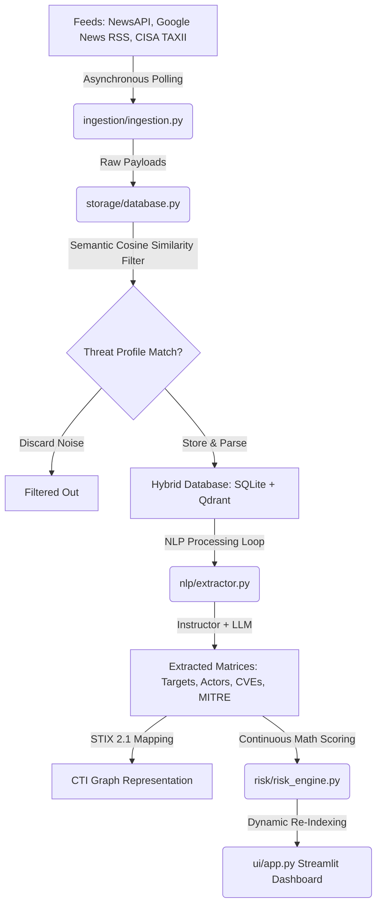

# AI-Driven OSINT Threat Monitoring Prototype

This repository contains a decoupled, asynchronous, Python-centric OSINT Threat Monitoring prototype. The system polls raw unstructured threat intelligence data, applies semantic vector filters, extracts structured entities under a strict Pydantic JSON schema using local AI models, calculates numerical risk prioritization indices, and renders them in an interactive dashboard.

---

## Architecture Overview



1. **Ingestion Layer (`ingestion/ingestion.py`):** Asynchronous polling workers fetch threat signals from NewsAPI, Google News RSS feeds, and official CISA TAXII 2.1 servers.
2. **Storage Layer (`storage/database.py`):** A hybrid database pairing a relational store (SQLAlchemy + SQLite) for operational stats and risk metrics with a vector search collection (Qdrant Client + Sentence-Transformers) for high-dimensional semantic indexing. Includes a semantic filter to drop irrelevant noise.
3. **AI & NLP Extraction (`nlp/extractor.py`):** Uses the `instructor` library paired with local small-parameter LLMs to extract structural entity matrices (Targets, Threat Actors, CVEs, and MITRE ATT&CK elements) validated directly against Pydantic schemas, mapping them to valid STIX 2.1 JSON schemas.
4. **Risk Prioritization Engine (`risk/risk_engine.py`):** Combines the Asset Weight Vector ($\vec{W}_a$) and continuous threat impact vectors ($\vec{I}_i$) alongside a source-credibility ($R_s$) weighted time-decay function ($e^{-\lambda \Delta t}$) to rank active threat relevance.
5. **Presentation Console (`ui/app.py`):** A Streamlit dashboard showcasing real-time threat tables, interactive weight tuning sliders, deep JSON schema inspection, and PDF report exports.

---

## Getting Started

### Prerequisites

All package management and virtual environments are handled by **`uv`**. Ensure `uv` is installed on your local system:
```bash
# Verify installation
uv --version
```

### Environment Configurations & API Keys

1. **Local LLM Server (Optional):**
   The NLP layer connects to a local Ollama instance (defaulting to `http://localhost:11434/v1` using model `llama3.1:8b`).
   * If the LLM server is offline, the pipeline will **gracefully fall back to local rule-based heuristic parsing** to ensure continuous execution.
2. **NewsAPI Token (Optional):**
   * If you have a NewsAPI key, you can configure it inside the `IngestionPipeline(news_api_key="your_key")` initialization. If not provided, the pipeline skips NewsAPI and continues polling Google News RSS and CISA TAXII feeds.

---

## Step-by-Step Usage

### 1. Install Dependencies
Initialize and sync the virtual environment using `uv`:
```bash
uv sync
```
*No pip commands or `requirements.txt` are required.*

### 2. Standalone Verification
You can run individual component dry-runs to test ingestion, database filtering, and risk scoring:

*   **Test Ingestion:**
    ```bash
    uv run python ingestion/ingestion.py
    ```
*   **Test Semantic Filter & Storage:**
    ```bash
    uv run python storage/database.py
    ```
*   **Test NLP Extractor & STIX Mapping:**
    ```bash
    uv run python nlp/extractor.py
    ```
*   **Test Risk Engine Calculus:**
    ```bash
    uv run python risk/risk_engine.py
    ```

### 3. Launch the Operator Dashboard
Run the Streamlit frontend:
```bash
uv run streamlit run ui/app.py
```

---

## Accessing Prototype Outputs

*   **Relational Metadata Database:** Saved to `osint_threats.db` in the workspace root. You can inspect operational stats and processed logs using any SQLite browser.
*   **Vector Database Indexes:** Stored locally in the `./data/qdrant` directory.
*   **STIX 2.1 JSON Schema:** Displayed interactively inside the "Deep Threat Entity & STIX 2.1 Inspection" dashboard pane when highlighting a target alert.
*   **Exported PDF Intelligence Summaries:** Generated instantly on-demand. Click the **"Download Dashboard Threat Summary (PDF)"** button on the streamlit application to compile and download the briefing.
